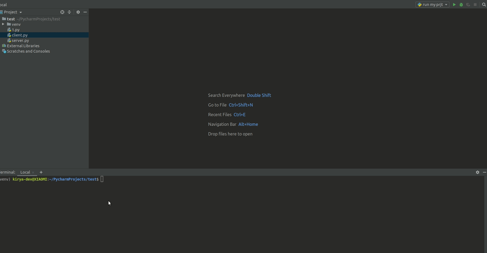

### Домашнее задание 2

Главная фича данного чата в том, что все взаимодействие происходит в одном терминале для одного клиента.

### Установка
`pip install -r requirements.txt`

### Запуск сервера
`python server.py`

### Запуск клиента
`python client.py`
